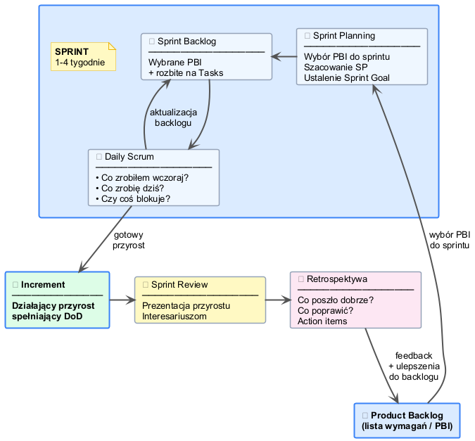

# Zarządzanie projektami IT

## Blok 1A – Teoria

**Studia podyplomowe BIM**
Kwiecień 2026

---

# Agenda – Blok 1A (60 min)

1. Czym jest projekt IT? *(10 min)*
2. Metodyki zarządzania *(25 min)*
   - Waterfall
   - Agile i Manifest
   - Scrum
   - Kanban
3. Role w projekcie IT *(15 min)*
4. Narzędzia: ADO vs Jira *(10 min)*

---

# Czym różni się projekt IT od budowy domu?

> 💬 **Dyskusja**: Co sprawia, że projekty IT są inne?

| Budowa domu | Projekt IT |
|---|---|
| Fizyczny produkt | Niematerialny produkt |
| Wymagania z góry znane | Wymagania zmieniają się w trakcie |
| Zmiana = kosztowna przeróbka | Zmiana = kwestia priorytetów |
| Prosta ocena postępu | Trudno ocenić „gotowość" |

---

# Dlaczego projekty IT się nie udają?

**Chaos Report (Standish Group)**

- ✅ ~30% projektów kończy się **sukcesem**
- ⚠️ ~50% projektów to **problemy** (czas, budżet, zakres)
- ❌ ~20% projektów to **klęska** (anulowane)

**Główne przyczyny niepowodzeń:**
1. Niejasne, zmieniające się wymagania
2. Brak zaangażowania klienta / interesariuszy
3. Brak priorytyzacji – robimy wszystko naraz
4. Słaba komunikacja w zespole

---

# Trójkąt projektowy (Iron Triangle)

```
        ZAKRES
          /\
         /  \
        /    \
       /______\
    CZAS     BUDŻET
```

- **Klasyczne projekty**: stały zakres, elastyczny czas i budżet
- **Projekty IT (Agile)**: stały czas i budżet, **elastyczny zakres**

> W IT pytamy: *„Co możemy zrobić w tym czasie i za te pieniądze?"*

---

# Metodyki – Waterfall

## Model kaskadowy

**Wymagania → Projektowanie → Implementacja → Testowanie → Wdrożenie**

| ✅ Zalety | ❌ Wady |
|---|---|
| Przewidywalny harmonogram | Zmiana wymagań = katastrofa |
| Dobra dokumentacja | Długi czas do pierwszego wyniku |
| Jasne kamienie milowe | Klient widzi produkt na końcu |

**Kiedy stosować:**
- Stałe, dobrze znane wymagania
- Systemy medyczne, lotnicze, embedded
- **BIM**: projekt wykonawczy – wymagania ustalone przed budową

---

# Metodyki – Manifest Agile (2001)

## 4 wartości

| ← Bardziej cenimy | Niż → |
|---|---|
| **Ludzi i interakcje** | Procesy i narzędzia |
| **Działające oprogramowanie** | Obszerną dokumentację |
| **Współpracę z klientem** | Negocjowanie umów |
| **Reagowanie na zmiany** | Podążanie za planem |

> Cenimy rzeczy po prawej *(„Niż")*, ale **bardziej** te po lewej *(„Bardziej cenimy")*.

---

# Metodyki – Scrum: Filary i Artefakty

## Trzy filary
- 🔍 **Przejrzystość** – wszyscy widzą to samo
- 📋 **Inspekcja** – regularnie sprawdzamy postęp
- 🔄 **Adaptacja** – zmieniamy plan gdy trzeba

## Artefakty

| Artefakt | Opis |
|---|---|
| **Product Backlog** | Lista wszystkich wymagań (PBI) |
| **Sprint Backlog** | Zadania zaplanowane na sprint |
| **Increment** | Działający, gotowy przyrost |

---

# Metodyki – Scrum: Zdarzenia

| Zdarzenie | Cel | Dziś |
|---|---|---|
| **Sprint Planning** | Zaplanuj sprint | ~20 min |
| **Daily Scrum** | Synchronizacja 3 pytania | ~10 min |
| **Sprint Review** | Pokaż przyrost | ~15 min |
| **Retrospektywa** | Poprawa procesu | ~15 min |

## Sprint = timeboxed iteracja
- Zazwyczaj **1–4 tygodnie**
- Dziś: **45 minut** = jeden sprint

---

# Scrum – Sprint w praktyce



---

# Metodyki – Kanban

## Tablica Kanban

| To Do | In Progress | Review | Done |
|---|---|---|---|
| Zadanie A | Zadanie B | Zadanie C | ✅ |
| Zadanie D | | | ✅ |

**WIP Limit**: max 2 zadania „In Progress" naraz

> Zamiast zaczynać nowe – **kończ to, co zaczęte**!

---

# Scrum vs Kanban

| | Scrum | Kanban |
|---|---|---|
| **Iteracje** | Tak (1–4 tygodnie) | Nie – ciągły przepływ |
| **Role** | PO, SM, Dev | Opcjonalne |
| **Zmiany w trakcie** | Nie (w sprincie) | Tak (zawsze) |
| **Planowanie** | Sprint Planning | Ciągłe |
| **Dobre dla** | Nowych produktów | Wsparcia, utrzymania |

---

# Role w projekcie IT

| Rola | Odpowiedzialność | W projekcie powieści |
|---|---|---|
| **Product Owner** | Wizja, backlog, priorytety | Wydawca / Redaktor |
| **Scrum Master** | Facylitacja, impedimenty | Coach projektowy |
| **Developer** | Tworzenie, szacowanie | Pisarz / Autor |
| **QA / Tester** | Jakość, defekty, DoD | Korektor |
| **Stakeholder** | Odbiorca, wymagania | Czytelnik docelowy |

---

# Ćwiczenie: Czyja to odpowiedzialność?

## Scenariusze – kto reaguje?

1. Klient chce zmienić priorytet w trakcie sprintu
2. Nikt nie wie jak skonfigurować narzędzie – sprint stoi
3. Postać w rozdziale 2 ma dwa różne imiona
4. Pytanie: ile czasu zajmie napisanie rozdziału 3?
5. Czy powieść jest gotowa do publikacji?

> ✋ Wskaż rolę dla każdego scenariusza!

---

# Ćwiczenie: Odpowiedzi

| Scenariusz | Rola | Dlaczego |
|---|---|---|
| Zmiana priorytetu | PO + SM | PO decyduje, SM chroni sprint |
| Blokada narzędzia | SM | Impediment = odpowiedzialność SM |
| Dwa imiona postaci | QA | Bug/defect – zgłasza QA |
| Szacowanie czasu | Developer | To dev zna złożoność |
| Gotowość do publikacji | PO + QA | Akceptacja PO + Definition of Done |

---

# Narzędzia: Azure DevOps vs Jira

| Cecha | ADO Free | Jira Free |
|---|---|---|
| Użytkownicy | **5** | 10 |
| Scrum boards | ✅ | ✅ |
| Kanban boards | ✅ | ✅ |
| CI/CD | 1800 min/mies. | ❌ |
| Integracja MS 365 | Natywna ✅ | Plugin |
| Repozytorium Git | ✅ | ✅ |
| Karta płatnicza | ❌ nie trzeba | ❌ nie trzeba |
| Konto wymagane | Microsoft 365 / Azure | Dowolny e-mail |

---

# Dlaczego Jira dziś?

- ✅ Bez karty płatniczej
- ✅ Dowolny e-mail – bez konta Microsoft
- ✅ Do 10 użytkowników za darmo
- ✅ Najpopularniejsze narzędzie Agile/Scrum na rynku
- ✅ Intuicyjny interfejs – łatwy do opanowania od zera

> Azure DevOps wymaga dziś konta Microsoft 365 lub subskrypcji Azure do założenia organizacji

---

# Podsumowanie – Blok 1A

## Zapamiętaj:

1. 📐 **Trójkąt projektowy** – w IT zakres jest elastyczny
2. 🌊 **Waterfall** – dobre dla stałych wymagań
3. 🔄 **Scrum** – iteracje, role, artefakty, zdarzenia
4. 📋 **Kanban** – przepływ, WIP Limit, bez sprintów
5. 👥 **Role** – PO, SM, Dev, QA – każdy ma swoją odpowiedzialność

---

# Pytania?

## Następnie: Blok 1B – Przygotowanie

- Podział na zespoły i losowanie gatunków
- Zakładanie kont Jira
- Konfiguracja projektu i backlogu
- **Sprint Planning** – zaplanujemy nasz sprint!
